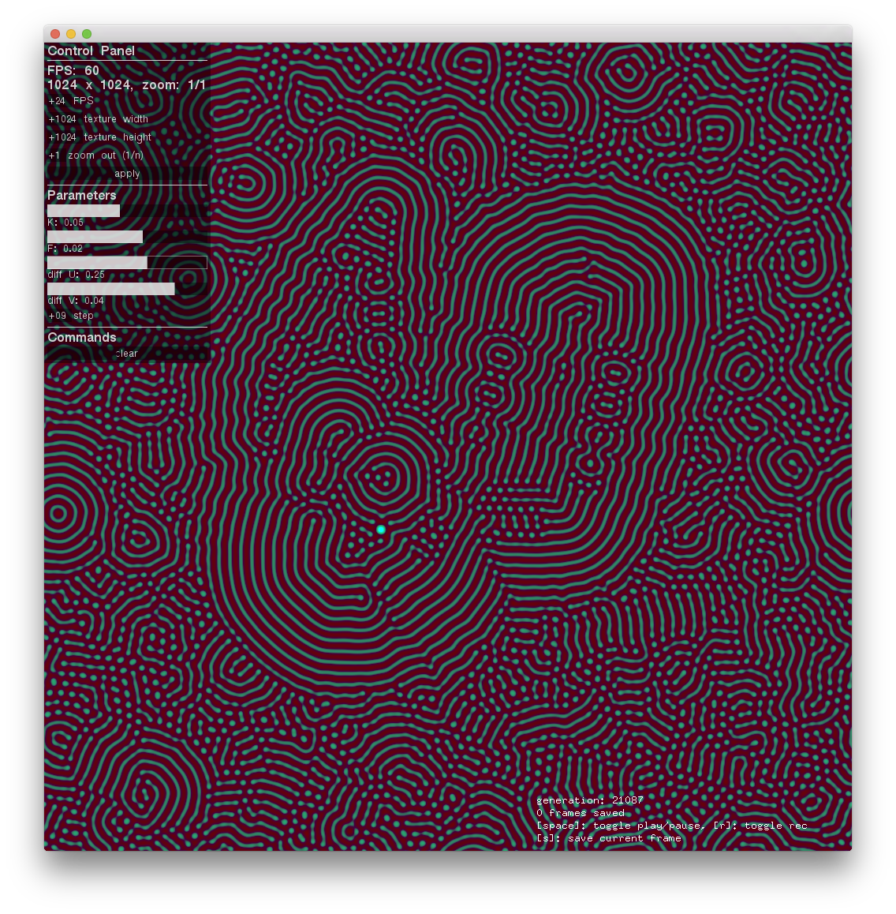

# GrayScottGenerator
This app generates a turing pattern with gray-scott model and export an image sequence.
The most part of the shader quotes from [ofxFX's gray-scott example](https://github.com/patriciogonzalezvivo/ofxFX/blob/master/src/generative/ofxGrayScott.h).

[Downlaod](https://github.com/baku89/GrayScottGenerator/releases)

## Usage

* [space] : toggle playing
* [r]: start/stop recording
* [s]: save current frame

The images exported as `data/[filename]/[filename]########.tiff` with the same directory of app.

## Licensing

VirtualMapper is published under a MIT License. See the included LISENCE file.

## Todo

* support loading initial condition as image
* add some parameters (scale, flow diffusing directions..)
* enable to simulate a surface of polygon